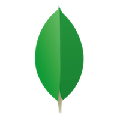

## Hi 👋, I'm Monica!
<p>



</p>

<br/>

### About me

I'm a full-stack web developer who find on technology and coding a path to grow and improve personal and professionally day by day. <br><br>
<a href="mailto:monibixv2@gmail.com"></a> &nbsp; &nbsp;
<a href="https://www.linkedin.com/in/monica-pigrau/"></a>

### Things I know
<p>
    
    
    
    
    
    
    
    
    
    
        
     
     
     
     
     

</p>


```js
const aboutMe = {
    pronouns: "she" | "her", 
    code: [JavaScript, HTML5, CSS3], 
    tools: [React, ExpressJS, NodeJS, MongoDB, Git], 
    hobbies: [👩‍💻,🚐,⛵,🚵‍♀️,⛷️,🚣‍♀️,🤿,⚽,🏀,🎾,🏐,🏓,🏸,🧘,📙]
}
```

### Cool projects
[LocalMarket - Muka'Shop](https://local-market.netlify.app/) - A web app to connect local shops with final clients<br>
[Cocktail Party](https://ironhackcocktailparty.herokuapp.com/cocktails) - App to create, find and share cocktails receipts. <br>
[ScubaShark](https://monibix.github.io/ScubaShark/) - Game done with pure JS
